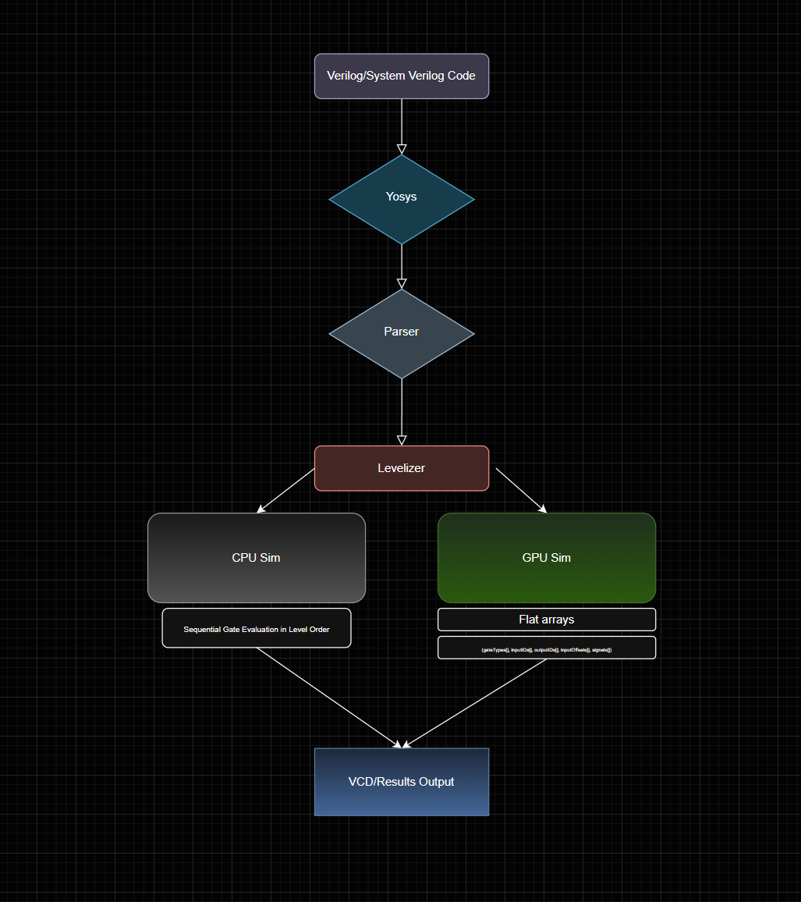
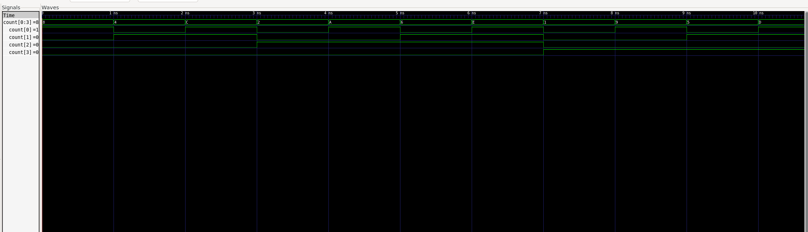

# GPU-Accelerated Logic Gate Simulator

### Overview: A CUDA-accelerated gate-level circuit simulator that parses Yosys-synthesized netlists and evaluates them in parallel on the GPU, with CPU/GPU benchmarking to explore the extent to which GPU parallelization pays off.

## Architecture Diagram



## GTKWave Waveform



## About

A gate-level circuit simulator that evaluates synthesized Verilog netlists cycle by cycle, with one specific caveat: the added ability to offload gate evaluation to NVIDIA CUDA cores for parallel execution.

The pipeline works like this: you write Verilog/SystemVerilog, run it through Yosys to synthesize it down to individual gate primitives (`$_AND_`, `$_MUX_`, `$_DFF_P_`, etc.), then the parser reads that netlist into C++ data structures. The levelizer sorts every gate using Kahn's algorithm so that each gate is assigned a dependency level, which ensures that no gate evaluates before its inputs are ready.

From there, the circuit can run on either the CPU or GPU. The CPU evaluates gates sequentially in level order. The GPU flattens the entire netlist into integer arrays (`gateTypes[]`, `inputIDs[]`, `outputIDs[]`, `inputOffsets[]`, `signals[]`), copies them to device memory, and launches one CUDA kernel per logic level, which evaluates all gates in that level in parallel. DFF updates happen on the CPU between clock cycles.

Results are written to a VCD file for waveform viewing in GTKWave. Benchmarking was done on a Ryzen 5 7600X and RTX 3060 Ti.

## Supported Gates

* Combinational: AND, OR, NOT, NAND, NOR, XOR, XNOR, MUX, ANDNOT, ORNOT
* Sequential: DFF (supports `$_DFF_P_`, `$_DFF_N_`, `$_SDFF_PP0_`)

## Yosys Integration
### To synthesize a Verilog/SystemVerilog design for the simulator:

```
yosys
read_verilog -sv your_design.sv
synth
flatten
dffunmap
simplemap
splitnets
write_verilog -noattr -noexpr output_synth.v
exit
```

- `synth` — runs the standard synthesis flow
- `flatten` — inlines all submodules into a single module
- `dffunmap` — converts complex DFFs into simple `$_DFF_P_` + `$_MUX_`
- `simplemap` — breaks multi-bit cells down to single-bit gate primitives
- `splitnets` — splits bus signals into individual wires
- `-noattr -noexpr` — forces structural output the parser can read


## How to Build/Run

### Dependencies
- NVIDIA CUDA Toolkit (nvcc)
- g++ (GCC)
- Yosys (for synthesis, via WSL or Linux)
- GTKWave (for waveform viewing)

### Usage
1. Synthesize your design with the Yosys flow above
2. Place the output `.v` file in the project directory
3. Update `main.cpp`:
   - Change the filename in `parseVerilog("your_synth.v")`
   - Set your design's input signals (e.g. `inputValues["clk"] = 0`)
4. Recompile and run

### Compile
```
nvcc main.cpp parser.cpp levelizer.cpp simulator.cpp vcd.cpp gpu_simulator.cu -o sim
```

### Run
```
./sim
```

## File Structure

| File | Description |
|------|-------------|
| `main.cpp` | Entry point, benchmarking, VCD output |
| `parser.cpp/h` | Parses Yosys-synthesized Verilog netlists |
| `levelizer.cpp/h` | Kahn's algorithm for topological gate ordering |
| `simulator.cpp/h` | CPU gate-level simulator |
| `gpu_simulator.cu/h` | CUDA GPU simulator with flat array architecture |
| `vcd.cpp/h` | VCD waveform file writer |
| `netlist.h` | Gate, Netlist structs and GateType enum |
