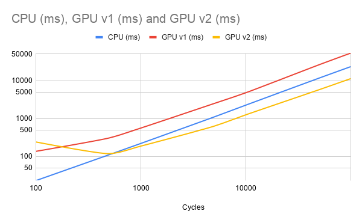

# GPU-Accelerated Logic Gate Simulator

### Overview: A CUDA-accelerated gate-level circuit simulator that parses Yosys-synthesized netlists and evaluates them in parallel on the GPU, with CPU/GPU benchmarking to explore the extent to which GPU parallelization pays off.

## Architecture Diagram


## GTKWave Waveform


## About

A gate-level circuit simulator that evaluates synthesized Verilog netlists cycle by cycle, with one specific caveat: the added ability to offload gate evaluation to NVIDIA CUDA cores for parallel execution.

The pipeline works like this: you write Verilog/SystemVerilog, run it through Yosys to synthesize it down to individual gate primitives (`$_AND_`, `$_MUX_`, `$_DFF_P_`, etc.), then the parser reads that netlist into C++ data structures. The levelizer sorts every gate using Kahn's algorithm so that each gate is assigned a dependency level, which ensures that no gate evaluates before its inputs are ready.

From there, the circuit can run on either the CPU or GPU. The CPU evaluates gates sequentially in level order. The GPU flattens the entire netlist into integer arrays (`gateTypes[]`, `inputIDs[]`, `outputIDs[]`, `inputOffsets[]`, `signals[]`), copies them to device memory, and launches one CUDA kernel per logic level, which evaluates all gates in that level in parallel. DFF updates happen on the CPU between clock cycles.

Results are written to a VCD file for waveform viewing in GTKWave. Benchmarking was done on a Ryzen 5 7600X and RTX 3060 Ti.

## Benchmarks

### Tested on a 20,170-gate, 8676-DFFF netlist synthesized from a [custom 16-bit pipelined RISC CPU](https://github.com/goshoryuken/pipelined-risc-cpu).



| Cycles | CPU (ms) | GPU v1 (ms) | GPU v2 (ms) |
|--------|----------|-------------|-------------|
| 100 | 23 | 136 | 240 |
| 500 | 111 | 307 | 118 |
| 1,000 | 220 | 560 | 187 |
| 5,000 | 1,101 | 2,491 | 629 |
| 10,000 | 2,252 | 4,776 | 1,251 |
| 50,000 | 11,651 | 26,228 | 5,755 |
| 100,000 | 23,345 | 53,163 | 11,288 |

### GPU v1 vs. v2

**v1** launched one CUDA kernel per logic level per cycle, with `cudaDeviceSynchronize` after each ~500K kernel launches for 10K cycles. The GPU was consistently **2.5x slower** than the CPU.

**v2** replaced this with a single persistent kernel using CUDA Cooperative Groups and grid-stride loops. All cycles and levels run inside one kernel launch, synchronized with `grid.sync()` instead of returning to the host. Grid striding ensures every thread processes gates across all levels, eliminating idle threads. GPU went from 2.5x slower to **2x faster** at scale.

## Supported Gates

* Combinational: AND, OR, NOT, NAND, NOR, XOR, XNOR, MUX, ANDNOT, ORNOT
* Sequential: DFF (supports `$_DFF_P_`, `$_DFF_N_`, `$_SDFF_PP0_`)


## Yosys Integration
### To synthesize a Verilog/SystemVerilog design for the simulator:

```
yosys
read_verilog -sv your_design.sv
synth
flatten
dffunmap
simplemap
splitnets
autoname
write_verilog -noattr -noexpr output_synth.v
exit
```

- `synth`: runs the standard synthesis flow (each module independently)
- `flatten`: inlines all submodules into a single flat netlist
- `dffunmap`: decomposes complex DFFs (e.g. `$_SDFF_PP0_`) into simple `$_DFF_P_` + combinational logic
- `simplemap`: breaks multi-bit cells down to single-bit gate primitives
- `splitnets`: splits bus signals into individual wires
- `autoname`: assigns globally unique names to all internal wires, preventing name collisions across flattened submodules
- `-noattr -noexpr`: forces clean structural output the parser can read

> **Note:** `autoname` must run **after** all transformation passes (`dffunmap`, `simplemap`, `splitnets`) to catch every auto-generated wire name. Without it, submodules that share internal wire names (e.g. `_00005_`) will collide after `flatten`, creating multi-driven nets that cause nondeterministic GPU simulation results.


## How to Build/Run

### Dependencies
- NVIDIA CUDA Toolkit (nvcc)
- g++ (GCC)
- Yosys (for synthesis, via WSL or Linux)
- GTKWave (for waveform viewing)

### Usage
1. Synthesize your design with the Yosys flow above
2. Place the output `.v` file in the project directory
3. Update `main.cpp`:
   - Change the filename in `parseVerilog("your_synth.v")`
   - Set your design's input signals (e.g. `inputValues["clk"] = 0`)
4. Recompile and run

### Compile
```
nvcc -rdc=true -std=c++17 -Xcompiler "/std:c++17 /Zc:preprocessor" main.cpp parser.cpp levelizer.cpp simulator.cpp vcd.cpp gpu_simulator.cu -o sim
```

### Run
```
./sim.exe
```

## File Structure

| File | Description |
|------|-------------|
| `main.cpp` | Entry point, benchmarking, VCD output |
| `parser.cpp/h` | Parses Yosys-synthesized Verilog netlists |
| `levelizer.cpp/h` | Kahn's algorithm for topological gate ordering |
| `simulator.cpp/h` | CPU gate-level simulator |
| `gpu_simulator.cu/h` | CUDA GPU simulator with flat array architecture |
| `vcd.cpp/h` | VCD waveform file writer |
| `netlist.h` | Gate, Netlist structs and GateType enum |

## Things To Note
- Kernel launch overhead dominated when the work per launch is small, raw parallelism doesn't help if you're spending more time scheduling then computing.
- Persisent kernels with Cooperative Groups eliminate this by keeping threads from going idle on the GPU and synchonizing with `grid.sync()` instead of returning to the host.
- Grid striding allows for a fixed number of threads to process arbitrarily large workloads without wasting threads.
- Flattening graph-structured data (gate netlists) into flat integer arrays is very important for GPU memory access.
- The v1 implementation, where one kernel launched per level every single cycle displayed how the GPU isn't automatically "faster" even if it has way more cores. 

## Known Limitations
-